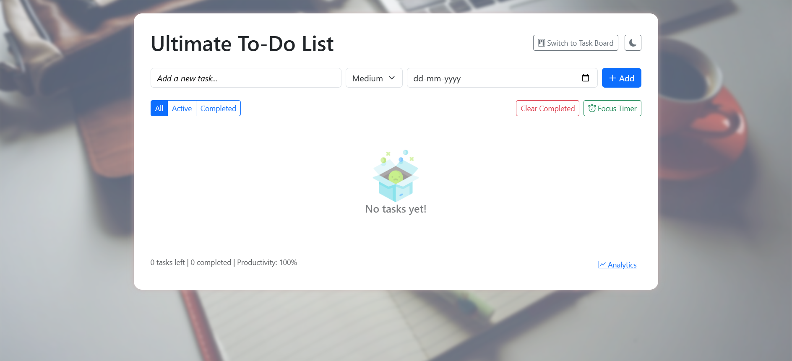
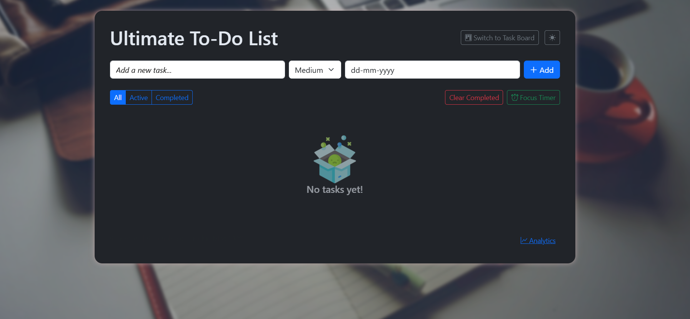

#  Ultimate To-Do List

A feature-rich, modern, and responsive to-do list web application designed to boost productivity. Built with vanilla JavaScript, it offers a clean user interface and powerful tools to manage your daily tasks effectively. This project demonstrates a strong understanding of core front-end development principles, including state management, modular code structure, and user experience design. It is built from the ground up to showcase foundational web development skills without relying on a heavy framework.
 
---

## 📸 Screenshots


*The application in a clean, light mode.*


*The application in a sleek, dark mode with the Task Board view active.*

*(Tip: Use a screen recording tool to create a GIF showcasing the app's features, like drag-and-drop and theme switching!)*

---

## ⭐ Key Features

This isn't just a simple to-do list. It's a productivity powerhouse packed with features for a modern workflow:

-   **📝 Full CRUD Functionality:** Add, edit, and delete tasks with ease.
-   **🎨 Dual Themes:** Easily switch between a sleek **dark mode** and a clean **light mode**. Your theme preference is saved for your next visit.
-   **📋 Multiple Views:** Organize tasks in a traditional **List View** or a drag-and-drop **Task Board** (similar to Trello/Kanban).
-   **🚀 Task Prioritization:** Assign **High, Medium, or Low** priority to tasks, visually distinguished by color.
-   **📅 Due Dates:** Set deadlines for your tasks to stay on track.
-   **💾 Local Storage Persistence:** Your tasks are automatically saved in your browser, so you never lose your progress between sessions.
-   **🔍 Dynamic Filtering:** Quickly filter tasks to see what's **All, Active, or Completed**.
-   **📊 In-Depth Analytics:** Get insights into your productivity with a detailed analytics modal, showing stats like tasks completed today, completion rate, and average completion time.
-   **🍅 Integrated Pomodoro Timer:** Use the **Focus Timer** to concentrate on your tasks without distractions, with options for short and long breaks.
-   **🎉 Fun & Interactive:** Enjoy a satisfying **confetti celebration** upon completing a task.
-   **📱 Fully Responsive:** Looks and works great on all devices, from large desktops to small mobile phones.

---

## 🛠️ Technologies Used

This project was built using fundamental web technologies, showcasing core development skills without relying on a heavy framework.

-   **Core:** HTML5, CSS3, Vanilla JavaScript (ES6+)
-   **Styling & Layout:** [Bootstrap 5](https://getbootstrap.com/) for a responsive grid and base components.
-   **Drag & Drop:** [SortableJS](https://sortablejs.github.io/Sortable/) for the interactive Task Board functionality.
-   **Visuals:** [Canvas-Confetti](https://github.com/catdad/canvas-confetti) for the on-completion celebration.

---

## ⚙️ How to Run Locally

As a front-end project, running it locally is straightforward:

1.  **Clone the repository:**
    ```bash
    git clone https://github.com/your-username/your-repository-name.git
    ```
2.  **Navigate to the project directory:**
    ```bash
    cd your-repository-name
    ```
2.  **Open the file:**
    Simply open the `index.html` file in your favorite web browser (like Chrome, Firefox, or Edge).

---

## 📄 Code Overview

The entire application is intentionally contained within a single `index.html` file to demonstrate the ability to create a complex, stateful application in a constrained environment.
 
The JavaScript logic is structured for clarity and maintainability:

-   **`elements` Object:** A single, centralized object holds references to all necessary DOM elements, making the code clean and easy to read.
-   **`state` Object:** The application's state (the list of todos, current filter, view mode, etc.) is managed in a single `state` object. This acts as the "single source of truth."
-   **Core Functions (`addTodo`, `renderTodos`, `updateStats`):** These functions handle the main logic of the application. The `renderTodos` function is responsible for drawing the UI based on the current state.
-   **Event-Driven Architecture:** The application responds to user interactions through event listeners, which call specific functions to update the state and re-render the UI.
-   **Feature Modularity:** Logic for distinct features like the Pomodoro Timer, Task Board, and Analytics is grouped into its own set of functions, making the codebase easy to navigate.

---

## 🙋 Author

- **Ganesh Prasad Panda**
